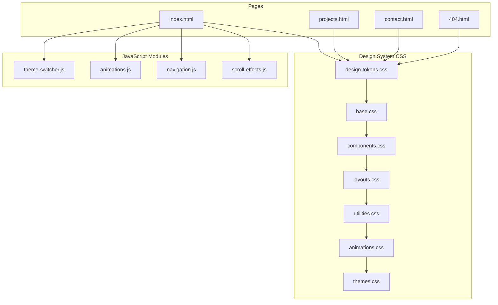
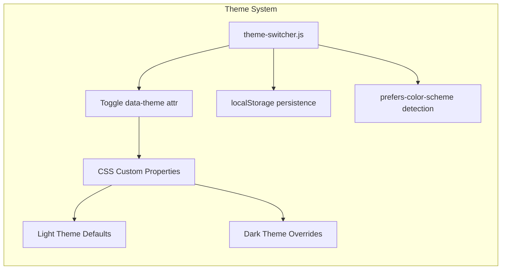
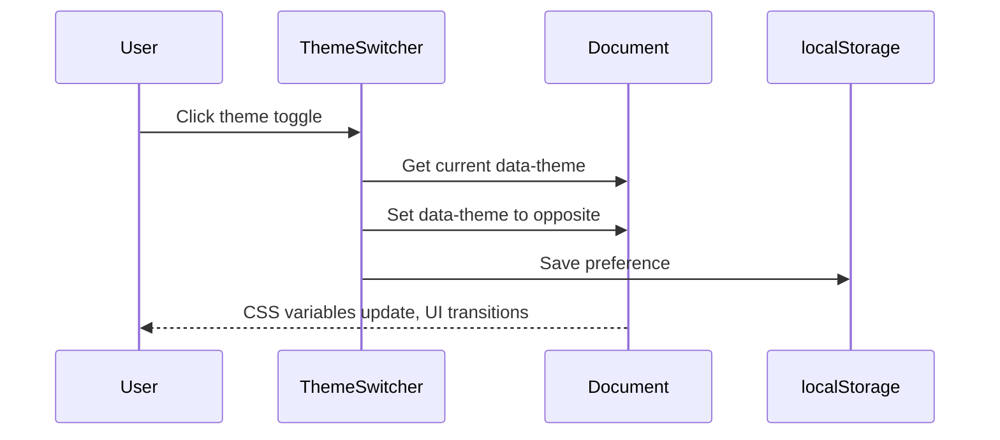
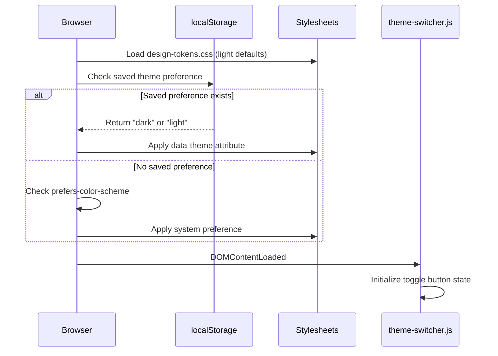
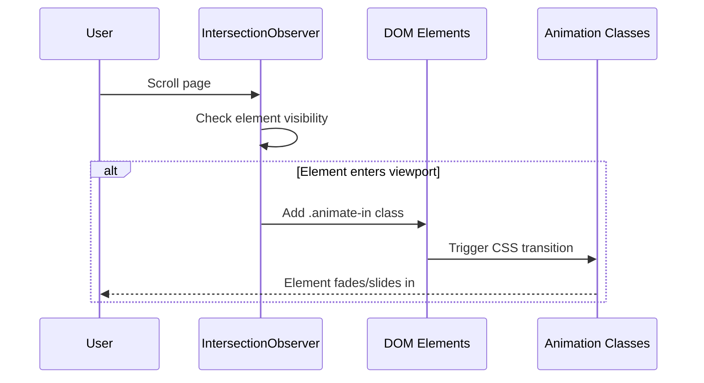

# Design Document: Portfolio Redesign

## Overview

This design covers a complete UI overhaul of an existing static portfolio website (HTML/CSS/JS, deployed on GitHub Pages) to achieve a modern, premium aesthetic with glassmorphism effects, gradient color palettes, smooth micro-interactions, dark/light mode support, and full responsive design across mobile, tablet, and desktop breakpoints.

The redesign preserves the existing page structure (Home, Projects, Contact) and vanilla tech stack (no frameworks or build tools) while introducing a scalable component-based CSS design system with CSS custom properties, a unified animation library, and accessibility-first patterns. The goal is a visually stunning, performant, and accessible portfolio that works seamlessly across all devices.

The existing BEM-based CSS architecture and semantic HTML structure provide a solid foundation. The redesign will evolve the current design tokens, introduce new visual layers (glassmorphism cards, gradient backgrounds, soft shadows), add a theme switcher for dark/light modes, and implement scroll-driven micro-interactions — all without introducing build dependencies.

## Architecture





## Sequence Diagrams

### Theme Toggle Flow



### Page Load with Theme Restoration



### Scroll Animation Flow



## Components and Interfaces

### Component 1: Design Token System

**Purpose**: Single source of truth for all visual properties across light and dark themes.

**Interface**:
```css
/* design-tokens.css */
:root {
  /* Brand Gradient Palette */
  --gradient-primary: linear-gradient(135deg, #667eea 0%, #764ba2 100%);
  --gradient-accent: linear-gradient(135deg, #f093fb 0%, #f5576c 100%);
  --gradient-hero: linear-gradient(135deg, #0c0d1a 0%, #1a1b3a 50%, #2d1b69 100%);

  /* Surface Colors - Light Theme */
  --surface-primary: #ffffff;
  --surface-secondary: #f8f9fc;
  --surface-elevated: rgba(255, 255, 255, 0.7);
  --surface-glass: rgba(255, 255, 255, 0.25);

  /* Text Colors */
  --text-primary: #1a1a2e;
  --text-secondary: #4a4a6a;
  --text-muted: #8888a8;
  --text-inverse: #ffffff;

  /* Glassmorphism */
  --glass-bg: rgba(255, 255, 255, 0.15);
  --glass-border: rgba(255, 255, 255, 0.2);
  --glass-blur: 12px;
  --glass-shadow: 0 8px 32px rgba(31, 38, 135, 0.15);

  /* Soft Shadows */
  --shadow-sm: 0 2px 8px rgba(99, 99, 140, 0.08);
  --shadow-md: 0 4px 16px rgba(99, 99, 140, 0.12);
  --shadow-lg: 0 8px 32px rgba(99, 99, 140, 0.16);
  --shadow-xl: 0 16px 48px rgba(99, 99, 140, 0.2);
  --shadow-glow: 0 0 20px rgba(102, 126, 234, 0.3);

  /* Border Radius */
  --radius-sm: 8px;
  --radius-md: 12px;
  --radius-lg: 16px;
  --radius-xl: 24px;
  --radius-full: 9999px;

  /* Typography */
  --font-display: 'Inter', -apple-system, BlinkMacSystemFont, sans-serif;
  --font-body: 'Inter', -apple-system, BlinkMacSystemFont, sans-serif;
  --font-mono: 'JetBrains Mono', 'Fira Code', monospace;

  /* Spacing Scale (8px base) */
  --space-1: 0.25rem;
  --space-2: 0.5rem;
  --space-3: 0.75rem;
  --space-4: 1rem;
  --space-6: 1.5rem;
  --space-8: 2rem;
  --space-12: 3rem;
  --space-16: 4rem;
  --space-24: 6rem;

  /* Transitions */
  --ease-out-expo: cubic-bezier(0.16, 1, 0.3, 1);
  --ease-spring: cubic-bezier(0.34, 1.56, 0.64, 1);
  --duration-fast: 150ms;
  --duration-normal: 300ms;
  --duration-slow: 500ms;
}

/* Dark Theme Overrides */
[data-theme="dark"] {
  --surface-primary: #0f0f1a;
  --surface-secondary: #1a1a2e;
  --surface-elevated: rgba(26, 26, 46, 0.8);
  --surface-glass: rgba(255, 255, 255, 0.05);

  --text-primary: #e8e8f0;
  --text-secondary: #a8a8c8;
  --text-muted: #6868a8;

  --glass-bg: rgba(255, 255, 255, 0.05);
  --glass-border: rgba(255, 255, 255, 0.08);
  --glass-shadow: 0 8px 32px rgba(0, 0, 0, 0.3);

  --shadow-sm: 0 2px 8px rgba(0, 0, 0, 0.2);
  --shadow-md: 0 4px 16px rgba(0, 0, 0, 0.3);
  --shadow-lg: 0 8px 32px rgba(0, 0, 0, 0.4);
  --shadow-xl: 0 16px 48px rgba(0, 0, 0, 0.5);
}
```

**Responsibilities**:
- Define all color, spacing, typography, and effect tokens
- Provide dark theme overrides via `[data-theme="dark"]` selector
- Ensure WCAG AA contrast ratios in both themes

### Component 2: Glassmorphism Card

**Purpose**: Reusable card component with frosted glass effect for project cards, info cards, and feature highlights.

**Interface**:
```css
.glass-card {
  background: var(--glass-bg);
  backdrop-filter: blur(var(--glass-blur));
  -webkit-backdrop-filter: blur(var(--glass-blur));
  border: 1px solid var(--glass-border);
  border-radius: var(--radius-lg);
  box-shadow: var(--glass-shadow);
  padding: var(--space-6);
  transition: transform var(--duration-normal) var(--ease-out-expo),
              box-shadow var(--duration-normal) var(--ease-out-expo);
}

.glass-card:hover {
  transform: translateY(-4px);
  box-shadow: var(--shadow-xl);
}
```

**Responsibilities**:
- Render frosted glass background with backdrop-filter
- Provide hover lift animation
- Gracefully degrade in browsers without backdrop-filter support

### Component 3: Theme Switcher

**Purpose**: Toggle between light and dark themes with persistence and system preference detection.

**Interface**:
```javascript
class ThemeSwitcher {
  constructor(toggleSelector)
  getSystemPreference()       // returns 'light' | 'dark'
  getSavedPreference()        // returns 'light' | 'dark' | null
  applyTheme(theme)           // sets data-theme on <html>
  toggle()                    // switches current theme
  init()                      // initializes on page load
}
```

**Responsibilities**:
- Detect system color scheme preference via `prefers-color-scheme`
- Persist user choice in `localStorage`
- Apply theme via `data-theme` attribute on `<html>`
- Animate transition between themes
- Update toggle button icon/state

### Component 4: Scroll Animator

**Purpose**: Trigger entrance animations when elements scroll into the viewport.

**Interface**:
```javascript
class ScrollAnimator {
  constructor(options)
  observe(selector)           // start observing elements matching selector
  unobserve(element)          // stop observing a specific element
  destroy()                   // cleanup all observers
}
```

**Responsibilities**:
- Use IntersectionObserver for performant scroll detection
- Apply staggered animation delays to sibling elements
- Respect `prefers-reduced-motion` media query
- Support configurable thresholds and root margins

## Data Models

### Theme Configuration

```javascript
const ThemeConfig = {
  light: 'light',
  dark: 'dark',
  storageKey: 'portfolio-theme',
  transitionDuration: 300,
  defaultTheme: 'light'
};
```

### Animation Configuration

```javascript
const AnimationConfig = {
  threshold: 0.15,
  rootMargin: '0px 0px -60px 0px',
  staggerDelay: 100,       // ms between sibling animations
  defaultDuration: 600,    // ms
  defaultEasing: 'cubic-bezier(0.16, 1, 0.3, 1)',
  types: {
    fadeUp: { opacity: [0, 1], transform: ['translateY(30px)', 'translateY(0)'] },
    fadeIn: { opacity: [0, 1] },
    scaleIn: { opacity: [0, 1], transform: ['scale(0.9)', 'scale(1)'] },
    slideLeft: { opacity: [0, 1], transform: ['translateX(-30px)', 'translateX(0)'] }
  }
};
```

### Navigation State

```javascript
const NavState = {
  isOpen: false,
  currentPage: '',          // 'index' | 'projects' | 'contact'
  scrolled: false,          // header shadow state
  scrollThreshold: 50       // px before header gets shadow
};
```

**Validation Rules**:
- Theme must be either 'light' or 'dark'
- Animation threshold must be between 0 and 1
- staggerDelay must be a positive integer
- currentPage must match a known page identifier


## Key Functions with Formal Specifications

### Function 1: ThemeSwitcher.applyTheme()

```javascript
applyTheme(theme) {
  document.documentElement.setAttribute('data-theme', theme);
  localStorage.setItem(ThemeConfig.storageKey, theme);
  this.updateToggleButton(theme);
}
```

**Preconditions:**
- `theme` is either `'light'` or `'dark'`
- `document.documentElement` exists and is accessible
- `localStorage` is available (not in private browsing restrictions)

**Postconditions:**
- `document.documentElement.getAttribute('data-theme')` equals `theme`
- `localStorage.getItem(ThemeConfig.storageKey)` equals `theme`
- Toggle button icon reflects the current theme state
- All CSS custom properties update to match the selected theme

**Loop Invariants:** N/A

### Function 2: ThemeSwitcher.init()

```javascript
init() {
  const saved = this.getSavedPreference();
  const system = this.getSystemPreference();
  const theme = saved || system || ThemeConfig.defaultTheme;
  this.applyTheme(theme);
  this.bindToggle();
  this.listenForSystemChanges();
}
```

**Preconditions:**
- DOM is fully loaded (called after DOMContentLoaded)
- Toggle button element exists in the DOM

**Postconditions:**
- A valid theme is applied to the document
- Toggle button click handler is bound
- System preference change listener is active
- If no saved preference exists, system preference is used
- If neither exists, default theme ('light') is applied

**Loop Invariants:** N/A

### Function 3: ScrollAnimator.observe()

```javascript
observe(selector) {
  const elements = document.querySelectorAll(selector);
  elements.forEach((el, index) => {
    el.style.transitionDelay = `${index * AnimationConfig.staggerDelay}ms`;
    this.observer.observe(el);
  });
}
```

**Preconditions:**
- `selector` is a valid CSS selector string
- IntersectionObserver is supported (or polyfilled)
- `this.observer` is initialized

**Postconditions:**
- All elements matching `selector` are observed by the IntersectionObserver
- Each element has a staggered `transitionDelay` applied
- Elements will receive `.animate-in` class when they enter the viewport

**Loop Invariants:**
- For each iteration `i`: `elements[i].style.transitionDelay === i * staggerDelay + 'ms'`
- All elements at indices `< i` are already being observed

### Function 4: createGlassCard()

```javascript
function createGlassCard(content, options = {}) {
  const card = document.createElement('div');
  card.className = `glass-card ${options.variant || ''} ${options.animate ? 'animate-on-scroll' : ''}`;
  card.innerHTML = content;
  if (options.hoverable !== false) {
    card.classList.add('glass-card--hoverable');
  }
  return card;
}
```

**Preconditions:**
- `content` is a valid HTML string or text content
- `options.variant` if provided is a valid CSS class name
- `options.animate` is a boolean
- `options.hoverable` is a boolean (defaults to true)

**Postconditions:**
- Returns a DOM element with class `glass-card`
- If `options.variant` provided, element has that additional class
- If `options.animate` is true, element has `animate-on-scroll` class
- If `options.hoverable` is not explicitly false, element has `glass-card--hoverable` class
- Element's innerHTML matches `content`

**Loop Invariants:** N/A

## Algorithmic Pseudocode

### Theme Initialization Algorithm

```pascal
ALGORITHM initializeTheme()
INPUT: none
OUTPUT: applied theme on document

BEGIN
  savedTheme ← localStorage.getItem("portfolio-theme")
  
  IF savedTheme IS NOT NULL AND savedTheme IN {"light", "dark"} THEN
    theme ← savedTheme
  ELSE
    mediaQuery ← window.matchMedia("(prefers-color-scheme: dark)")
    IF mediaQuery.matches THEN
      theme ← "dark"
    ELSE
      theme ← "light"
    END IF
  END IF
  
  document.documentElement.setAttribute("data-theme", theme)
  updateToggleButtonIcon(theme)
  
  ASSERT document.documentElement.getAttribute("data-theme") IN {"light", "dark"}
  
  RETURN theme
END
```

**Preconditions:**
- DOM is loaded and document.documentElement is accessible
- window.matchMedia is available

**Postconditions:**
- data-theme attribute is set to a valid theme value
- Toggle button reflects the active theme
- Theme persists across page navigations

### Scroll Animation Observer Algorithm

```pascal
ALGORITHM observeScrollAnimations(selector, config)
INPUT: selector (CSS selector string), config (AnimationConfig)
OUTPUT: IntersectionObserver watching matched elements

BEGIN
  IF user prefers reduced motion THEN
    elements ← querySelectorAll(selector)
    FOR EACH element IN elements DO
      element.classList.add("animate-in")
    END FOR
    RETURN null
  END IF
  
  callback ← FUNCTION(entries)
    FOR EACH entry IN entries DO
      IF entry.isIntersecting THEN
        entry.target.classList.add("animate-in")
        observer.unobserve(entry.target)
      END IF
    END FOR
  END FUNCTION
  
  observer ← NEW IntersectionObserver(callback, {
    threshold: config.threshold,
    rootMargin: config.rootMargin
  })
  
  elements ← querySelectorAll(selector)
  FOR i ← 0 TO elements.length - 1 DO
    ASSERT i * config.staggerDelay >= 0
    elements[i].style.transitionDelay ← (i * config.staggerDelay) + "ms"
    observer.observe(elements[i])
  END FOR
  
  RETURN observer
END
```

**Preconditions:**
- selector matches zero or more DOM elements
- config.threshold is in range [0, 1]
- config.staggerDelay is a non-negative integer

**Postconditions:**
- If reduced motion preferred: all elements immediately visible, no observer created
- Otherwise: observer watches all matched elements
- Each element animates in when it enters the viewport
- Elements are unobserved after animating (one-time trigger)

**Loop Invariants:**
- All elements at index < i have transitionDelay set and are being observed
- staggerDelay accumulates linearly

### Responsive Navigation Algorithm

```pascal
ALGORITHM handleNavigation(event)
INPUT: event (click or keyboard event)
OUTPUT: navigation state updated

BEGIN
  IF event.type = "click" AND event.target = toggleButton THEN
    IF navState.isOpen THEN
      closeMenu()
      toggleButton.setAttribute("aria-expanded", "false")
      navState.isOpen ← false
    ELSE
      openMenu()
      toggleButton.setAttribute("aria-expanded", "true")
      navState.isOpen ← true
      focusFirstMenuItem()
    END IF
  END IF
  
  IF event.type = "keydown" THEN
    IF event.key = "Escape" AND navState.isOpen THEN
      closeMenu()
      toggleButton.focus()
      navState.isOpen ← false
    END IF
  END IF
  
  ASSERT toggleButton.getAttribute("aria-expanded") = String(navState.isOpen)
END
```

**Preconditions:**
- Toggle button and nav menu elements exist in DOM
- navState is initialized

**Postconditions:**
- aria-expanded reflects actual menu state
- Focus is managed appropriately for keyboard users
- Menu state is consistent with visual presentation

## Example Usage

### Theme Switcher Integration

```javascript
// In main.js - initialize on page load
document.addEventListener('DOMContentLoaded', () => {
  const themeSwitcher = new ThemeSwitcher('.theme-toggle');
  themeSwitcher.init();
});

// HTML for toggle button
// <button class="theme-toggle" aria-label="Toggle dark mode">
//   <span class="theme-toggle__icon theme-toggle__icon--light">☀️</span>
//   <span class="theme-toggle__icon theme-toggle__icon--dark">🌙</span>
// </button>
```

### Scroll Animations Integration

```javascript
// Initialize scroll animations for various sections
document.addEventListener('DOMContentLoaded', () => {
  const animator = new ScrollAnimator({
    threshold: 0.15,
    rootMargin: '0px 0px -60px 0px'
  });

  animator.observe('.glass-card');
  animator.observe('.section__title');
  animator.observe('.hero__stat');
  animator.observe('.skill-category');
});
```

### Glassmorphism Card in HTML

```html
<article class="glass-card glass-card--hoverable animate-on-scroll">
  <div class="glass-card__image">
    
  </div>
  <div class="glass-card__content">
    <h3 class="glass-card__title">AWS Serverless API</h3>
    <p class="glass-card__description">Scalable serverless architecture...</p>
    <div class="glass-card__tags">
      <span class="tag">AWS Lambda</span>
      <span class="tag">DynamoDB</span>
    </div>
  </div>
</article>
```

### Responsive Hero Section

```html
<section class="hero">
  <div class="hero__bg-gradient" aria-hidden="true"></div>
  <div class="hero__particles" aria-hidden="true"></div>
  <div class="container hero__content">
    <div class="hero__text">
      <span class="hero__greeting animate-on-scroll">Hello, I'm</span>
      <h1 class="hero__title animate-on-scroll">Dineshraj Dhanapathy</h1>
      <p class="hero__role animate-on-scroll">Cloud & DevOps Engineer</p>
      <p class="hero__description animate-on-scroll">...</p>
      <div class="hero__actions animate-on-scroll">
        <a href="projects.html" class="btn btn--gradient">View My Work</a>
        <a href="contact.html" class="btn btn--glass">Get In Touch</a>
      </div>
    </div>
    <div class="hero__visual animate-on-scroll">
      <div class="hero__photo-ring">
        
      </div>
    </div>
  </div>
</section>
```

## Correctness Properties

*A property is a characteristic or behavior that should hold true across all valid executions of a system — essentially, a formal statement about what the system should do. Properties serve as the bridge between human-readable specifications and machine-verifiable correctness guarantees.*

### Property 1: Theme toggle is its own inverse

*For any* starting theme T in {"light", "dark"}, calling `toggle()` twice returns the theme to its original state: `toggle(toggle(T)) === T`.

**Validates: Requirement 2.1**

### Property 2: Theme persistence round-trip

*For any* theme T in {"light", "dark"}, if the Theme_Switcher saves T to localStorage and a new page load occurs, the applied `data-theme` attribute on `<html>` equals T.

**Validates: Requirements 2.2, 2.3**

### Property 3: Theme validation rejects invalid values

*For any* string S stored in localStorage under the key "portfolio-theme" where S is not "light" and S is not "dark", the Theme_Switcher does not apply S as the data-theme attribute and instead falls back to system preference or default.

**Validates: Requirement 2.8**

### Property 4: Dark theme overrides all token values

*For any* CSS custom property defined in the Design_Token_System that has a dark theme override, when `data-theme` is set to "dark", the computed value of that property differs from its light theme value.

**Validates: Requirement 1.2**

### Property 5: Contrast compliance in both themes

*For any* text element E rendered in either light or dark theme, the contrast ratio between E's computed text color and its computed background color is at least 4.5:1.

**Validates: Requirement 1.3**

### Property 6: Toggle button icon matches active theme

*For any* theme change to theme T, the toggle button's visible icon state reflects T (sun icon for dark mode indicating "switch to light", moon icon for light mode indicating "switch to dark").

**Validates: Requirement 2.6**

### Property 7: Scroll animation triggers and unobserves

*For any* element with the `animate-on-scroll` class, when the IntersectionObserver callback fires with `isIntersecting === true`, the element receives the `animate-in` class and the observer stops observing that element.

**Validates: Requirements 4.1, 4.3**

### Property 8: Stagger delays are monotonically increasing

*For any* group of N sibling elements observed by the Scroll_Animator, the transition delay of element at index i is strictly less than the transition delay of element at index j for all i < j.

**Validates: Requirement 4.2**

### Property 9: Reduced motion disables all animations

*For any* animatable element E, if `prefers-reduced-motion: reduce` is active, E is immediately visible with no CSS transition or animation applied.

**Validates: Requirements 4.4, 8.4**

### Property 10: Navigation aria-expanded matches menu state

*For any* sequence of open and close operations on the mobile navigation menu, the `aria-expanded` attribute on the toggle button equals `"true"` when the menu is open and `"false"` when the menu is closed.

**Validates: Requirements 5.3, 5.4, 5.7**

### Property 11: Accessibility structure on all pages

*For any* page in the Portfolio_Site, the page contains skip links targeting main content, navigation, and footer, and uses semantic HTML elements (`header`, `main`, `nav`, `footer`) with appropriate ARIA roles.

**Validates: Requirements 8.1, 8.3**

### Property 12: Below-fold images have lazy loading

*For any* `` element positioned below the initial viewport fold, the element has the `loading="lazy"` attribute set.

**Validates: Requirement 7.2**

## Error Handling

### Error Scenario 1: localStorage Unavailable

**Condition**: Private browsing mode or storage quota exceeded prevents localStorage access.
**Response**: Catch the exception, fall back to system preference via `prefers-color-scheme`, and keep theme in memory only for the session.
**Recovery**: Theme works for the current session but won't persist across page loads.

### Error Scenario 2: backdrop-filter Not Supported

**Condition**: Older browsers (e.g., Firefox < 103, older Safari) don't support `backdrop-filter`.
**Response**: Use `@supports` query to provide a solid semi-transparent background fallback.
**Recovery**: Cards display with `background: rgba(255, 255, 255, 0.85)` instead of blur effect. Visual quality degrades gracefully.

### Error Scenario 3: IntersectionObserver Not Available

**Condition**: Very old browsers lack IntersectionObserver support.
**Response**: Check for API existence before use. If unavailable, immediately add `.animate-in` to all elements.
**Recovery**: All elements are visible immediately without scroll animations. No functionality is lost.

### Error Scenario 4: Font Loading Failure

**Condition**: Google Fonts CDN is unreachable or blocked.
**Response**: Font stack falls back to system fonts (`-apple-system, BlinkMacSystemFont, sans-serif`).
**Recovery**: Typography uses native system fonts which are already optimized for each platform.

## Testing Strategy

### Unit Testing Approach

- Test ThemeSwitcher: verify `applyTheme('dark')` sets correct attribute, `toggle()` switches state, `init()` respects saved preference over system preference
- Test ScrollAnimator: verify elements receive `.animate-in` class when intersection callback fires, verify stagger delays are correctly calculated
- Test navigation state management: verify aria-expanded matches isOpen state after each toggle
- Test glass-card fallback: verify `@supports` query correctly applies fallback styles

### Property-Based Testing Approach

**Property Test Library**: fast-check

- Theme toggle is its own inverse: `∀ initial ∈ {light, dark}: toggle(toggle(initial)) === initial`
- Stagger delay is monotonically increasing: `∀ i < j: delay(i) < delay(j)`
- All generated theme values are valid: `∀ theme from toggle(): theme ∈ {light, dark}`
- Responsive grid columns match breakpoint rules for any viewport width

### Integration Testing Approach

- Full page load test: verify theme is applied before first paint (no flash of wrong theme)
- Cross-page navigation: verify theme persists when navigating between index, projects, and contact pages
- Resize test: verify navigation collapses/expands correctly across breakpoint boundaries
- Accessibility audit: run axe-core on each page in both themes to verify no violations

## Performance Considerations

- Use `will-change: transform` sparingly and only on elements that will animate
- Prefer CSS transitions over JavaScript animations for GPU acceleration
- Use `content-visibility: auto` on below-fold sections for rendering performance
- Lazy-load images with `loading="lazy"` attribute (already in place)
- Minimize repaints: batch DOM reads/writes, avoid layout thrashing
- Keep CSS file size manageable by using custom properties instead of duplicating values
- Use `@media (prefers-reduced-motion: reduce)` to disable animations for users who prefer it
- Inline critical CSS for above-the-fold content to prevent render-blocking

## Security Considerations

- Sanitize any dynamic content injected via `innerHTML` (project cards)
- Use `rel="noopener noreferrer"` on all external links (already in place)
- Content Security Policy headers should allow `style-src 'self' 'unsafe-inline'` for CSS custom properties and inline critical CSS
- No sensitive data stored in localStorage (only theme preference string)
- Validate theme value from localStorage before applying (must be 'light' or 'dark')

## Dependencies

- **Google Fonts (Inter)**: Primary typeface, loaded via `<link>` with `font-display: swap`
- **No JavaScript frameworks**: Vanilla JS only, no npm dependencies
- **No build tools**: All CSS and JS served directly, no bundling or transpilation
- **GitHub Pages**: Static hosting, no server-side processing
- **Formspree**: Existing contact form service (unchanged)
